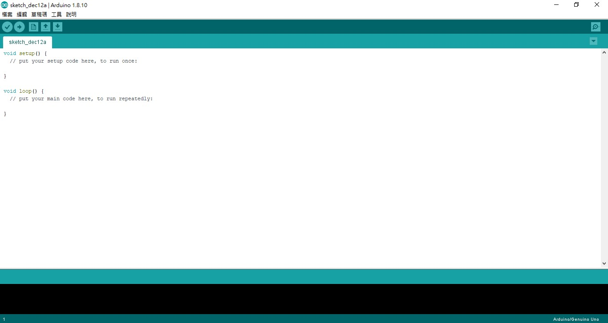

# arduino-dino

---

# arduino

+ 硬體
+ 軟體

---

# arduino環境



---

# 腳位

+ 5V
+ GND
+ D1~D13
+ A1~A7

---

+ 每行指令用分號(；)結尾
+ 程式由函式組成
+ 一定要有`void setup(){}`和`void loop(){}`函式

---

# 大致上的架構

```c++

```

---

# 輸入

`pinMode(腳位,INPUT);`
`digitalRead(腳位);`

---

# 按鈕、上拉電阻

`pinMode(腳位,INPUT_PULLUP);`

---

# 變數

+ 布林 boolean
+ 字元 char
+ 數字 
  + 整數 byte,int,long
  + 小數 float,double

|變數名稱|範圍                  |
|-------|----------------------|
|boolean|0,1                   |
|char   |-128~127              |
|byte   |0~255                 |
|int    |-32768~32767          |
|long   |-2147483648~2147483647|
|float  |+/-3.4E+38            |
|double |+/-3.4E+38            |

---


# 陣列

變數類型 陣列名稱[數量];

```c
int arr[10];
```

---

# I<sup>2</sup>C

---

# OLED螢幕

---

# 遊戲流程圖
