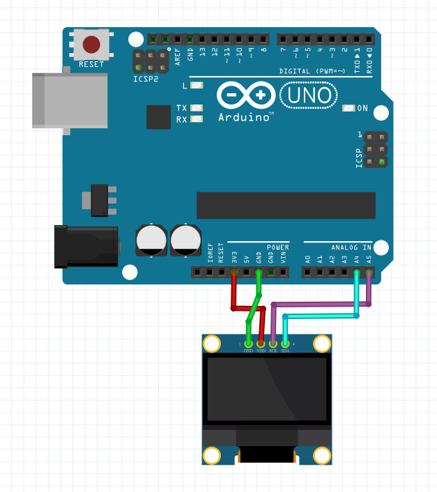

# **Arduino基本電路**

講師：賴諺毅、湯淯卉

---
# Arduino介紹
Arduino是一個易於使用的微控制器開發板，非常適合初學者和用於嘗試和實作
### 主要特點
1. 易於入門

2. 豐富的輸入/輸出接口

3. 開源

4. 支援社群

5. 可擴展性
---
# 主板介紹  

---
# 使用元件介紹  

杜邦線

---

營幕 SSD1306 0.96吋

![w:750](data:image/jpeg;base64,/9j/4AAQSkZJRgABAQAAAQABAAD/2wCEAAkGBxAQDw8PDw8NDw8PDQ8PDw8PDw8NDw8PFREWFhURFRUYHSggGBolHRUVITEhJSkrLzouFx8zRDMtNygtLysBCgoKDQ0OFxAQFy0dHx8rLS03Li0tNS0tNC0tKystLSstLS0rLi0tLTAtLS0tLS0rLSswLS0tLS0tLS0tLysrLf/AABEIAKgBKwMBIgACEQEDEQH/xAAcAAEBAAIDAQEAAAAAAAAAAAAAAQIGAwUHBAj/xAA2EAACAgECBAUBBgUEAwAAAAAAAQIDEQQhBRIxQQYTUWFxIgcyQlKBkRQjYqGxcoLB4TNj8f/EABkBAQEBAQEBAAAAAAAAAAAAAAABAgMEBf/EACIRAQEAAgICAgMBAQAAAAAAAAABAhEDIRIxIkEEQlFhMv/aAAwDAQACEQMRAD8A9ZAKQQAFApCgQpAQUEAAAAAAAAAAAACFIAAYAEDGQqggAoIUIAAAAAAAAAAAAAKACgACAACgACAAAAAAAAAAAAOLU6iFUXZbOFcIreU5KMV+rNI4v9osfrhw6izVzjtK3lkqYP8Ay/7Fkt9JbI3i66MIuU5RhGKy5SajFL3bNXt8faNX11R82dc5cr1KrktPB9vqfVZ7rY864Rxa/iOvhHXWOxKF066GuWp2xrlKEOTp1Xf0PQq/DrthTb50bIuCc65Q+hpreMcfdx/wXKeF1e0xtym5023JMmucH4zXXqZcNlNOcI5obe84LrB/1LP7L2NhMStq2MkyTIGRTHJkiiopABQAEAAAAAAAACFGAKACgACAAAAyAkAyAAAAAA+biPEadPB2X211QX4pySy/RLq37I0Dj32lTakuH6ac4rZ6m2DcV7xgv8v9jUxtS2R6DrdZVRB2XWQqguspyUV/c0jjPj+yULHw3SXaiNe0tTKuXlRftHrL9cGgx41C1XajiNll85QlXXz/AFxqk0/uw6Lt0R1+k49ZGiuurzoyi5quVbTbqs+/CUH959cP3NeN+pus+X9una6rWLVVx1XEL9TapXW1tVfd0zjFOP0LZOWdl6J7nWabxC4aOzSxhJc2ojdXdGXJbBrZprpLOEfPqeCamutW2V2QjKSUt/5i/wBaW6znv6n08Xo0VcIRqlYmk3KU8uyTb222XTH4dn3ZvU/a9X6c939Z2+W7TamtV6iULa/rzCzeM+ZPaT7p/JsVXjzV1wfmKqMmnmacoSm/zOtbZ91g1XXccsnnl2TbblhKUm+snjbL9TqpNt5bbfq9zGXymrPTpjjZd7dvqePTlb5qzz5zzveXXOz7HtXgTxRHXUYm1/EVxXOunPHopr/D9/lH59Z2vhrjVmj1ELa5Y5ZZ9mu6fs1s/wDozcdNv0pkyydbwbileqohfU9pLeL6wmusX7r/ALPvTMKzKmYplTAzRSFKKAAgAAABAKAAAAAoAKAAAAEAoCBAB8nFOJU6Wp3Xz5K4tLOHJtvoklu2ajrPFOq1MObSKGkplKUYai6PnX2NbPy6ltt6vJrXW/pLlN6bZxbi+n0kPM1N0Ko9uZ5lL2jFbyfwjQ+N/aHqLKrJ8O00lTWnzaq5LOE8Nwh02z3z8Gp+JOAayp/xOoc9VGXW2bsjJS7KWW8L2z+x1HEeLSuq00IuasrjdROChmVkJzjNy587t4iscuVy985NeP3j8mPLfWXxdjxSVVtNOo1Go1movupnbzYcq4S5pLyE3tlcqckntldjqJcVtVMKItpRnJ5hjMlLs/3e59FXArOequ1/wdN8ozTnPMeXZptZ68rylNrKXqNa6KJVSpnKNlUuZTTcrJTVknF74XRQ25V3zk3qes7tndv/ADHX6nh9kVW7qrIxnhxysOSWM4z3xjr6r1O01tmm0ttNmkssUq8ybnibk8vCxhfheGsY377t9ZxPj117y5PZJRy8tJdEvTB1Ty+oueV9dLOKffbuOLeJNRqJOUpvfCzsuiwunf36nTNt7t/uXAJMdOiYIUhRGRmRBYN0+znxU9Jd5dkn5NjUZr09Jr3X918I9whNNJppppNNbpp9Gj8tRk001s1umevfZf4rVkVo7pfUv/C3+7q/y1+q9DjlNK9LizNHCmciZlXImZI40zNFFAAQKAABCgAAAAAFABQAAAAAAAB1fiThEdXp5VtLnSbrb/Njp8M1rwjbCHJRZCLu0sLKXW8c7rlZzq6KfXDzGS69Gbw2aL9ovh1WqOqhzJwlHznBLnjHO9kVtl49/Qs762l670+vxZxKuOi1ELVHNixXVHHN1W+F/j3fY8k4VxKWitd0XDmxjl3ln6lJP6Wsbxj333Rx+IpW1z5HNyjhYlzOSmmk1NN7tPqdFkYbm5/TKTLVdpxLj997zOyb3eMyb5faP5V8YOrfuVIM6TGRWIAwaRjkFINAQZAAjAAxZz6LVSqnGcW0009nhpp5TT7PucLMWzGUV+hvBniKOtoTbXnQSVqW3N6WJejw/hpr0Nkgz84+EuPWaPUQsi9k903iMov70H7PH7pPsfoHhmvhqKoXVPMLIprplesX7rozjeqrsEZo4os5IsozKQBFAAAAAAAAGAAKACgAQAUhQBAAI2cNuGmmk0000900+qOWRxWAeW+MfDajmqKym5y0r7tdZUN+uXmPvlfiPL7q3F4Z+i+M6JX1SrffeL3XLNdGePeLOES3txiyMlHUR22se6nt+GW7/wBWV3RtmdXTVEyMNY6g3GgxyUhpAgYCIQpi5EtVcmLkYtjJi5LpSAjICPRfsx8SLTS8iyWKbJfVnpXN9LPjs/0fY87Sz2O34PppZja+VVQkuayyXlU5zvBz/E+2IpszrZbp+kq2c8DUvBPiGjV1Srqm3LTPy2pJxlKv8FmHvhrb5RtlbM6suqS7chSJlAAAAAAAAAEKAKCFKAAAAEABgAYs4po5mYNAfDdE1jxHwznzZGClLlcbINtebVjeD9+mH2aT7G3WwOv1VRqVmx4Jx/hbps6twlFSrl+aDeF8NYaa7NNHUpnrHijhEZJwxFRm3Kt9FXbhJp+kZ4Sfuovs8+W6zTuuTi0002mmmnFp4cWn3Nell24WQqZGzflAMXIjIZuS6RshkkXZe5jasVESS7FSbfdnLV5cX9alZL8NcHhN/wBUlv8Aov3RBwcplTRKfTlUV1snLkrj8y9fbr7H1Lhl1jXNHylJ/SmsLp0x1X6nJZwuOEov6oppJ7qTz/b/AOHOc2G+61cMpOowjKmtLl5dRP1nGUKIv2h1n/uaX9JvfhzTr+D0+rcXqNRdffXKTa/kQraSprS2gmvq2X4l6HnMYyx9Sws4z0w/Rne+GvE1uicq4R86myUZTpbcX5iWFZCST5Z9FnDyv0x7M+LeHxeXHk1l8np1VLhL+JrplTbTXKz6nlWV80VOuT9HlNfHrg3PgnEq9TTXfU8xms+8WtpRfummjzyriWv4hDy4wsqrksPm5JTx8pJJfJungvgC0NHlLrKTnLdv6mks7/CPLJr277bCigFAAEAAMAgAAIUAUgBRSAAAAAAIAIygDjmj5raz7Gccoga7xTRKcZRfSUWumTzTxZwdyjOfW6pJW/8Ashsld7tbKX+1/mPYtRTnJrHHuHOS5opOcE9nupLvB+qabWPd+puXbF67eFTjh4fYxO/8S8M5J81abrkm687tYf1VP+qLa+VKL77a+0S9Ny7GRg5NPp52Z5I5UfvybUYQXrOTwo/qwrBIsUum7fRRisybOZwrTjX5spty+qdcMVRz2Un9UvnB2miphTmUN5x9Wvqj3Rx5eS4e2+PGZuLR8Gsms2vyofljjnfyztaKKqViEUnjeT3k/l9Tju1uem+cYMatLZa8YfXot2z52WefJ7r3Y44YejU6rm+lZb2a9n2Z9nCuFzuknyvMsZXV57/BsfAPBFk8SmuSPvvJo9D4VwSqiKUIr5OmP4ts76c8+fGf6874j9nNk4Q8tV4c+aaeYyi8Ybi++dv2O58N/Z1TTiVqUpdcL/Db6noCiZJH0scrjjMY8Fxly8nz6XRwrjywjGKXosH0oiKRVAAAAEAAgFBCgAAAABQAAAAAAABAUgEDKQDCUD4tVp8pnYGEogeXeKeDJOfNiNVrT5sNqm5JqNyx23aaXWMpL0x51qOE2+ZZBQalU/5yylGr+qU3iKi1upN4a6H6E4pw5WRaa6po8x1HB5LiOkp1c5T0kbUo12Sapyk/KTXTDkox36dOh1llnbn3L00mvhuFzRqt1WO9ddq00fdzSUrO33eVb9WfJqrLJ4UntH7tcUoVVy32UFsvnr7nrGhetjZPFMJKM5Jpx3gk39K7Jexq/wBpmkrrtpthWq56iqLtrj058J5x29fXDQ4eSeWrE5cL47laPpouU1h4xuu7yvRGy6Ph0rOVpPft1fwfHwTgl9tsHFYblHdwcljPXHdfJ7nwXw9TTFPkjzY3wtk++Dz/AJ3Flnljq9O/4vJjjjdxoXBPBNk8OS5I5zlr6v0N+4R4apoWVFOX5nuzvIVpdEZmcOLHD03ny5ZMIQS6GeADo5hQAgCkAFAAAEAoAAAAAAQCgAoAAgAAoAAgEKAICkAgKQojR0XibgkdRVJY+rDx7+x3wA8m0nE+I87qcYyksQ8/6o2yitlzpbSl0WXg7TSeC56mxX6yUpS/qeZdf2X6G/rSQUnJRim+rwtzlSG5vc6PrVddw7g1NEUq4Je+NzsEjIAAXAIAAAoIUAQpAKAABCgCBhgACgCAoAMAAAAAAAAgAFIAAAABgAACACkAAFICigAgAAAUAoAAgAAAAABJPCbSy8PC6ZfoAB87vmsfyn2ziXT+2/8A18CV88v+VJpdGpR3QAFlfPCxVJ5Tym8Yf7YOaqTay04vL2e/RtZ/5IAP/9k=)

---

# 接線

---
## 對照
皆使用公對母杜邦線
| 螢幕 | 主板 | 
|:----:| :----:|
| GND | GND |
| VCC | 3V3 |
| SCL | A5 |
| SDA | A4 |
